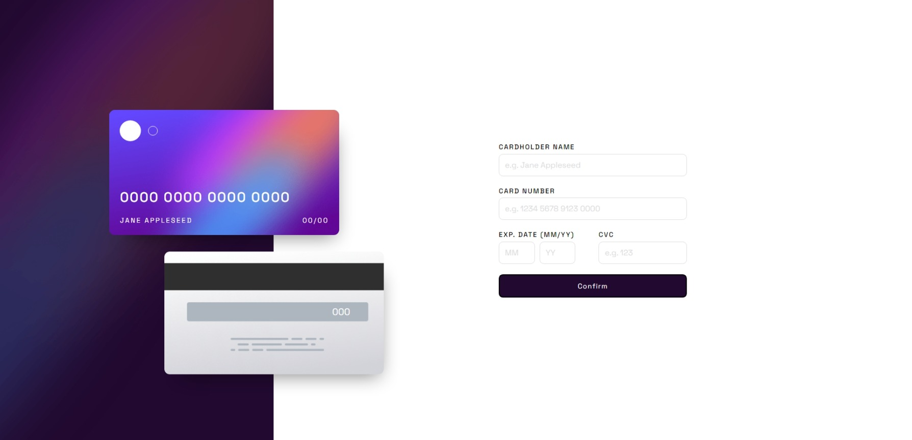
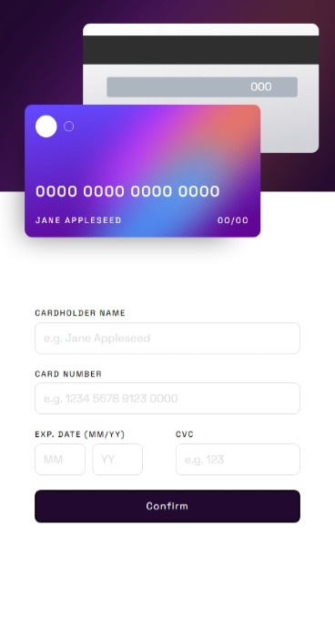
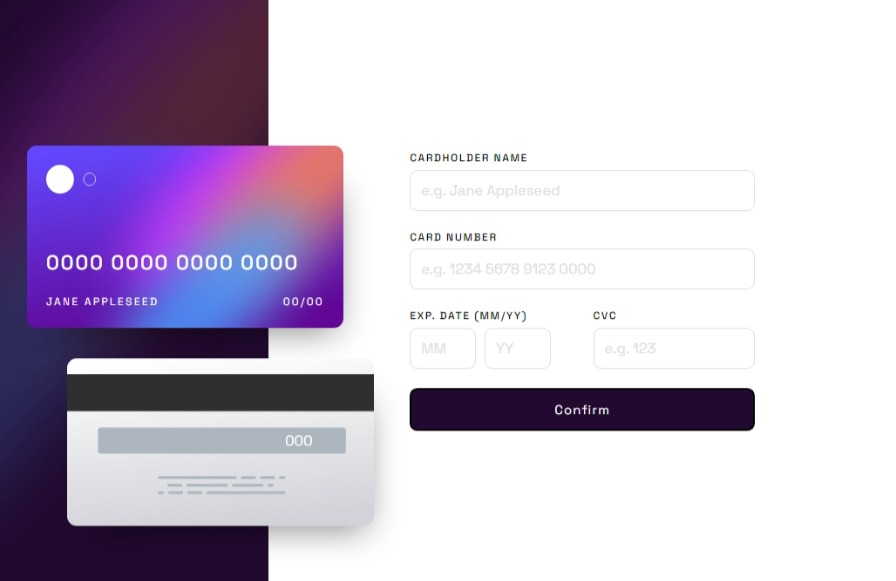

# Frontend Mentor - Interactive card details form solution

This is a solution to the [Interactive card details form challenge on Frontend Mentor](https://www.frontendmentor.io/challenges/interactive-card-details-form-XpS8cKZDWw). Frontend Mentor challenges help you improve your coding skills by building realistic projects. 

## Table of contents

- [Overview](#overview)
  - [The challenge](#the-challenge)
  - [Screenshot](#screenshot)
  - [Links](#links)
- [My process](#my-process)
  - [Built with](#built-with)
  - [What I learned](#what-i-learned)
  - [Continued development](#continued-development)
  - [Useful resources](#useful-resources)
- [Author](#author)
- [Acknowledgments](#acknowledgments)

## Overview

### The challenge

Users should be able to:

- Fill in the form and see the card details update in real-time
- Receive error messages when the form is submitted if:
  - Any input field is empty
  - The card number, expiry date, or CVC fields are in the wrong format
- View the optimal layout depending on their device's screen size
- See hover, active, and focus states for interactive elements on the page

### Screenshot

**#1. This is the *Desktop* view of the project**

**#2. This is the *Mobile* view of the project**

**#3. This is the *Tablet* view of the project**

**#4. This is the *Custom Validation* of the project**

**#5. This is the *Custom Individual Validation* of the project**

### Links

- Solution URL: [GitHub Repo](https://github.com/ravindra135/FrontEndMentor-interactive-card-details-form-main/)
- Live Site URL: [LIVE URL](https://ravindra135.github.io/FrontEndMentor-interactive-card-details-form-main/)

## My process

### Built with

- HTML5
- CSS
- JS

### What I learned

There are so many things I have Learned while building this project, especially the JS.

In this project you will find, 1 Markup File, 2 CSS files, and 1 JS file.

Go through the code, and let know the suggestions in Feedback section.

***Had Fun*** while building this Project:

- Responsive Design;

  - Design needs to be changed for row to column while switching between Desktop to Mobile View; And Cards Size needs to be adjusted, along with *font-size* to make the text responsive also.
  - Added Transition, which makes the switching or flexing more fluent and decent.

- The Javascript;

  - Writing the Custom Validation part.
  - Printing the Errors.

**Note: Some parts of the JS codes are length, consider improving them. As being a begginer I tried all of them myself;**

### Continued development

The Development will be continued as, the some part of challenge is incomplete indeed.

  - Border Color Change to Gradient, on Focus;
  - Updating Card Details in Real Time from input;

## Author

- Website - [Add your name here](https://www.your-site.com)
- Frontend Mentor - [@yourusername](https://www.frontendmentor.io/profile/yourusername)
- Twitter - [@yourusername](https://www.twitter.com/yourusername)

**Note: Delete this note and add/remove/edit lines above based on what links you'd like to share.**

## Author

- Frontend Mentor - [@ravindra135](https://www.frontendmentor.io/profile/ravindra135)
- Github - [@ravindra135](https://github.com/ravindra135/)
- Instagram - [@ravindra_since2k](https://www.instagram.com/ravindra_since2k/)

## Acknowledgments

I would really thank you [KEVIN POWELL](https://www.youtube.com/kepowob), for his wonderfull suggestion on giving a shot to Frontend Mentor. I think it worked for me. As, being a Backend Developer I wanted to go for Full-Stack so, I really need a strong hold on Advanced CSS. Frontend Mentor is really good to have a  realtime practice session on-the-go.